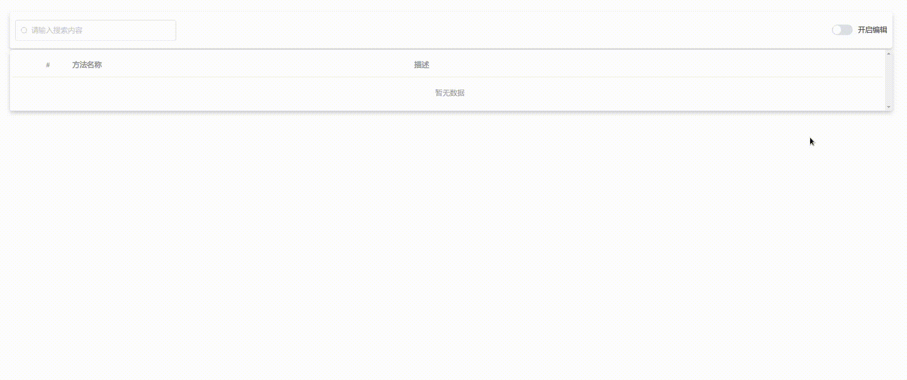

<p align="center"><a href="http://tanghuibo.github.io/code-collection" target="_blank" rel="noopener noreferrer"></a></p>

<p align="center">
  <a href="#"></a>
  <a href="#"></a>
  <br>
</p>

<h2 align="center">Code Collection</h2>

code colletion 是一个用于收藏和运行JavaScript脚本的工具，可以帮你快速创建和运行脚本，并将其导出分享给你的朋友或者同事。

### 效果展示




地址: http://tanghuibo.github.io/code-collection

### 功能介绍

- 编写脚本
- 管理脚本
- 运行脚本

#### 编写脚本

脚本分为两个部分，[参数](#编写脚本)部分和[方法](#编写脚本)部分

[参数](#编写脚本)为JSON数组格式，用于生成让用户填写的表单，每一项中有如下属性


| 参数    | 作用                                 |
| ------- | ------------------------------------ |
| label   | 表单标签                             |
| key     | [参数key](#编写脚本) |
| default | 默认值                               |

例子:

```json
[
  {
    "key": "name",
    "label": "名称"
  },
  {
    "key": "sex",
    "label": "性别",
    "default": "男"
  }
]
```

生成的表单为:


 [方法](#编写脚本)为function函数

```javas
function(param, print) {
 .....
}
```

第一个参数为用户提交的表单，表单的每一项通过[参数key](#编写脚本)获取

第二个参数为[print函数](#编写脚本),[print函数](#编写脚本)第一个入参为打印值的标签，第二个参数为打印值。

运行

```javascript
print("名称", "冯宝宝");
```

得


#### 管理脚本

除了基本的增删改查之外还指出[导入](#管理脚本)和[导出](#管理脚本)功能

为了让使用者不会用错脚本，建议:

- 脚本名称不要[重复](#管理脚本)
- 描述中讲清楚脚本的[用途](#管理脚本)

#### 运行脚本

填写表单，点击运行既可～
