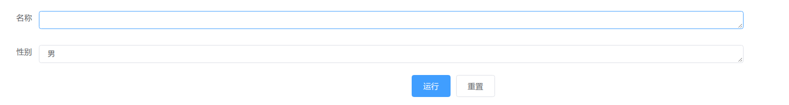

<p align="center"><a href="https://vuejs.org" target="_blank" rel="noopener noreferrer"></a></p>

<p align="center">
  <a href=""></a>
  <a href=""></a>
  <br>
</p>

<h2 align="center">Code Collection</h2>

code colletion 是一个用于收藏和运行 JavaScript 脚本的工具，可以帮你快速创建和运行脚本，并将其导出分享给你的朋友或者同事。

### 优点

- 使用简单，填好参数就能运行
- 利于分享，一人编写，全部门使用

### 功能介绍

- 编写脚本
- 管理脚本
- 运行脚本

#### 编写脚本

脚本分为两个部分，<font color="#67C23A">参数</font>部分和<font color="#67C23A">方法</font>部分

<font color="#67C23A">参数</font>为 JSON 数组格式，用于生成让用户填写的表单，每一项中有如下属性

<table>
  <tbody>
    <tr>
      <td align="center" valign="middle">
        参数
      </td>
      <td align="center" valign="middle">
        名称
      </td>
    </tr>
    <tr>
      <td align="center" valign="middle">
        label
      </td>
      <td align="center" valign="middle">
        表单标签
      </td>
    </tr>
    <tr>
      <td align="center" valign="middle">
        key
      </td>
      <td align="center" valign="middle">
        <a style="color: #E6A23C">参数key</a>
      </td>
    </tr>
    <tr>
      <td align="center" valign="middle">
        default
      </td>
      <td align="center" valign="middle">
        默认值
      </td>
    </tr>
  </tbody>
</table>

例子:

```json
[
  {
    "key": "name",
    "label": "名称"
  },
  {
    "key": "sex",
    "label": "性别"
  }
]
```

生成的表单为:



<font color="#67C23A">方法</font>为 function 函数

```javas
function(param, print) {
 .....
}
```

第一个参数为用户提交的表单，表单的每一项通过<font color="#E6A23C">参数 key</font>获取

第二个参数为<font color="#67C23A">print 函数</font>,<font color="#67C23A">print 函数</font>第一个入参为打印值的标签，第二个参数为打印值。

运行

```javascript
print("名称", "冯宝宝");
```

得


#### 管理脚本

除了基本的增删改查之外还指出<font color='#409eff'>导入</font>和<font color='#409eff'>导出</font>功能

为了让使用者不会用错脚本，建议:

- 脚本名称不要<font color="#F56C6C">重复</font>
- 描述中讲清楚脚本的<font color="#67C23A">用途</font>

#### 运行脚本

填写表单，点击运行既可～
